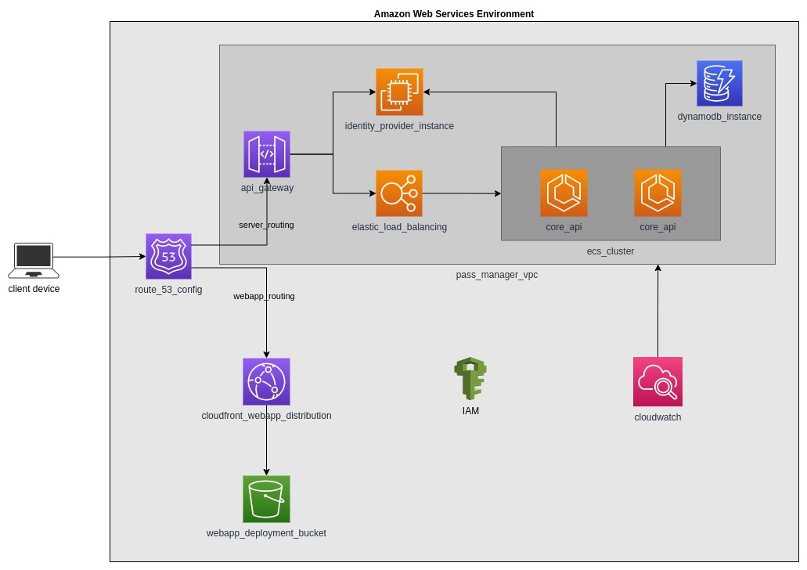

# Specialization in Distributed Software Architecture (PUC Minas 2022) - Integrated Project

## About the project

This integrated project is a partial requirement to obtain the title of **distributed software architecture specialist**.

The project proposes to develop a **password management application** using the material provided during the specialization.

## Statement

You must design the complete architecture for a project using a free subject, defining the context, problem, product target, technology stack and acting area.

It is planned to develop, throughout its life cycle a proof of concept that will allow evaluating the proposed architecture before its definitive adoption.

### What should be delivered
It is expected in end of the project, the following artifacts:

- An architectural Design Model document
- A draft of the Cloud solution
- Proof of concept (POC)

## Artifacts

### Architectural Design Model document

The document can be found at the `docs/` folder.

### Architecture definition records

The records can be found at the `docs/arch-definition-records` folder.

### Cloud solution

The desired Cloud solution is represented in the diagram below:

### Proof of Concept

This repository contains the code used at the Proof of Concept. You can access the web application [here](http://puc-pass-man.s3-website-us-east-1.amazonaws.com/) (temporary available).
